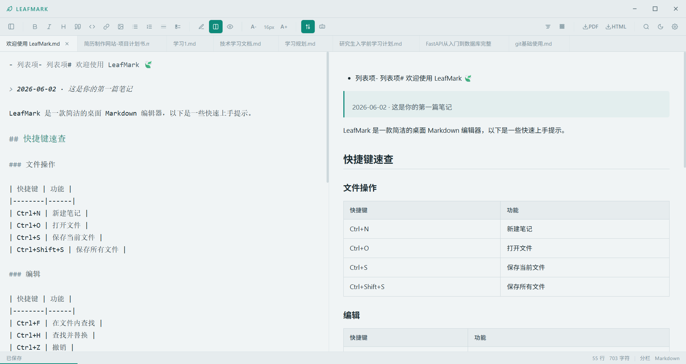
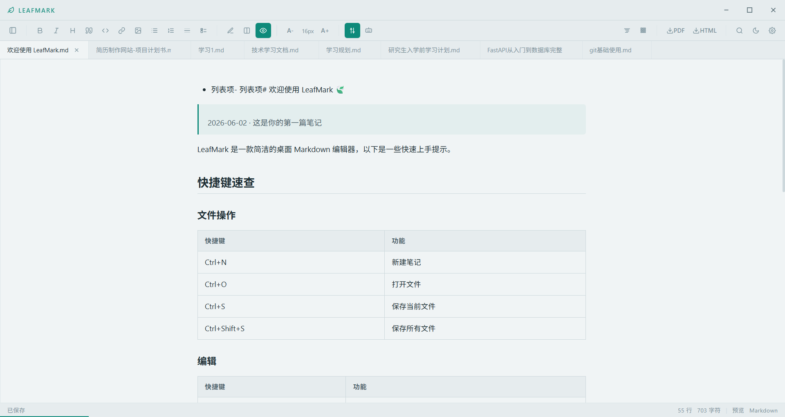
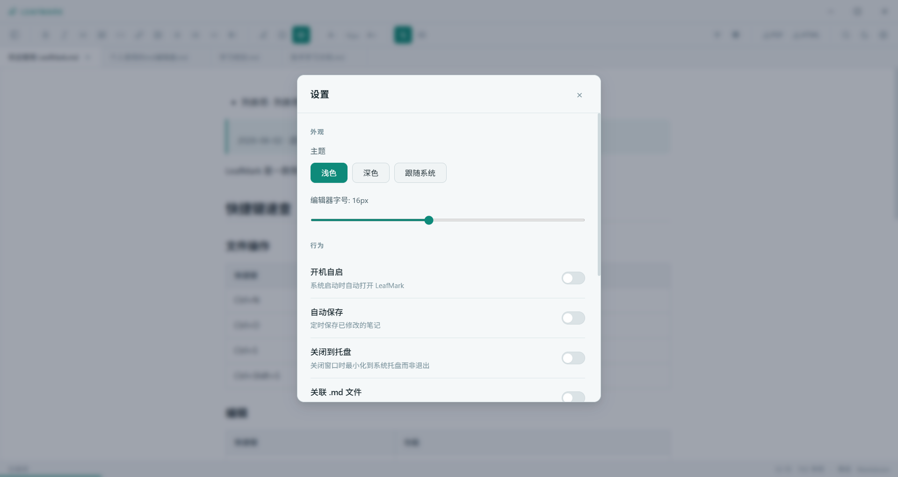
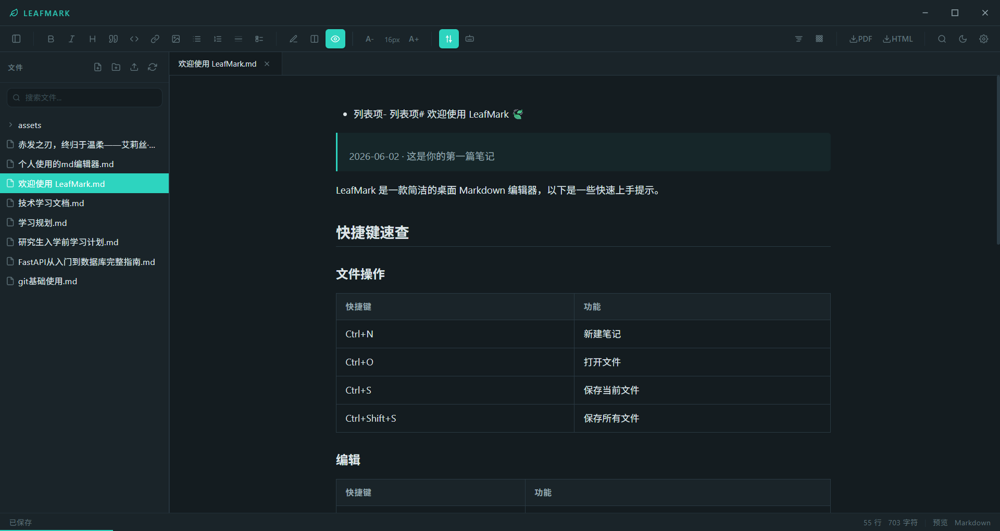
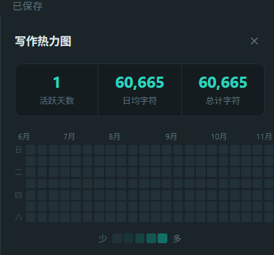

<div align="center">

# 🍃 LeafMark

**一款轻量、优雅的 Markdown 桌面笔记编辑器**

<!-- 替换为你的应用截图 -->


[](./LICENSE)


</div>

## ✨ 功能特性

### 📝 编辑体验
- **实时分屏预览** — 左侧编辑、右侧渲染，支持同步滚动
- **CodeMirror 6 编辑器** — 语法高亮、行号、代码折叠、多光标编辑
- **Markdown 全语法支持** — 标题、列表、表格、代码块、任务列表
- **数学公式** — KaTeX 渲染，支持 `$...$` 行内和 `$$...$$` 块级公式
- **代码高亮** — 20+ 种编程语言的语法高亮（在预览面板中）
- **格式工具栏** — 一键插入粗体、斜体、标题、链接、图片、表格等

<!-- 替换为分屏预览截图 -->


### 📂 文件管理
- **工作区模式** — 默认在 `Documents/LeafMark Notes` 下管理所有笔记
- **文件树** — 目录优先排序，支持创建文件/文件夹、重命名、删除
- **多标签页** — 同时打开多个文件，标签页显示修改状态
- **文件关联** — 双击 `.md` 文件直接用 LeafMark 打开
- **导入文件** — 从系统任意位置导入 Markdown 文件到工作区

### 🎨 个性化
- **主题切换** — 浅色 / 深色 / 跟随系统，一键切换
- **自定义字号** — 编辑器字号 10px - 24px 可调
- **字体选择** — 等宽字体优化，支持 JetBrains Mono / Fira Code

<!-- 替换为主题/设置截图 -->
| 浅色主题 | 深色主题 |
|:---:|:---:|
|  |  |

### 📊 写作统计
- **写作热力图** — GitHub 风格的贡献图，记录每日写作量
- **每日统计** — 记录字符数、编辑文件数

<!-- 替换为热力图截图 -->


### 🔧 实用功能
- **全文搜索** — 跨文件搜索与替换
- **文档大纲** — 自动提取标题生成目录，点击跳转
- **模板系统** — 内置日记、会议记录、读书笔记等模板
- **自动保存** — 可配置间隔时间，后台自动保存
- **关闭到托盘** — 最小化到系统托盘，随时唤出
- **导出功能** — 支持导出为 PDF 和 HTML
- **图片粘贴** — 从剪贴板粘贴图片，自动保存到 assets 目录

## ⚡ 快速开始

### 环境要求

- [Node.js](https://nodejs.org/) >= 18
- [pnpm](https://pnpm.io/) >= 8

### 安装与运行

```bash
# 克隆仓库
git clone https://github.com/your-username/leafmark.git
cd leafmark/leafmark

# 安装依赖
pnpm install

# 启动开发环境
pnpm dev
```

### 构建安装包

```bash
# Windows
pnpm build:win

# macOS
pnpm build:mac

# Linux
pnpm build:linux
```

构建产物输出到 `leafmark/dist/` 目录。

## 🛠️ 开发命令

| 命令 | 说明 |
|------|------|
| `pnpm dev` | 启动开发环境（Electron + Vite HMR） |
| `pnpm build` | 类型检查 + 生产构建 |
| `pnpm build:win` | 构建 Windows 安装包 |
| `pnpm build:mac` | 构建 macOS 安装包 |
| `pnpm build:linux` | 构建 Linux 安装包 |
| `pnpm lint` | ESLint 代码检查 |
| `pnpm format` | Prettier 代码格式化 |
| `pnpm typecheck` | TypeScript 类型检查 |
| `pnpm typecheck:node` | 仅检查主进程/预加载脚本 |
| `pnpm typecheck:web` | 仅检查渲染进程 |

## 🏗️ 技术架构

```
┌─────────────────────────────────────────────────────┐
│                    Electron 39                       │
├──────────────┬──────────────────┬───────────────────┤
│  Main Process│  Preload Script  │ Renderer Process  │
│  (Node.js)   │  (contextBridge) │ (React 19 SPA)    │
│              │                  │                   │
│  BrowserWin  │  electronAPI     │  CodeMirror 6     │
│  Tray        │  IPC bridge      │  markdown-it      │
│  IPC handlers│                  │  Zustand store    │
│  File system │                  │  KaTeX / hljs     │
└──────────────┴──────────────────┴───────────────────┘
```

### 核心技术栈

| 层级 | 技术 |
|------|------|
| 桌面框架 | Electron 39 |
| 构建工具 | electron-vite 5 + Vite 7 |
| 前端框架 | React 19 + TypeScript 5.9 |
| 编辑器 | CodeMirror 6 |
| Markdown 渲染 | markdown-it + highlight.js |
| 数学公式 | KaTeX |
| 状态管理 | Zustand 5（persist 到 localStorage） |
| 样式方案 | CSS Modules + CSS 自定义属性 |
| 包管理 | pnpm |

### 目录结构

```
leafmark/
├── src/
│   ├── main/              # 主进程
│   │   ├── index.ts       # 窗口创建、托盘、生命周期
│   │   └── ipc/
│   │       └── fileHandlers.ts  # IPC 处理器
│   ├── preload/           # 预加载脚本
│   │   ├── index.ts       # contextBridge 暴露 API
│   │   └── index.d.ts     # TypeScript 类型声明
│   └── renderer/          # 渲染进程
│       └── src/
│           ├── App.tsx         # 根组件
│           ├── main.tsx        # React 入口
│           ├── api/electron.ts # IPC 调用封装
│           ├── store/noteStore.ts  # Zustand 状态管理
│           ├── styles/global.css   # 主题系统
│           └── components/    # UI 组件
├── electron.vite.config.ts
├── electron-builder.yml
└── package.json
```

## 📄 开源协议

本项目基于 [MIT 协议](./LICENSE) 开源。

---

<div align="center">

**如果觉得 LeafMark 不错，给个 ⭐ Star 支持一下吧！**

</div>
